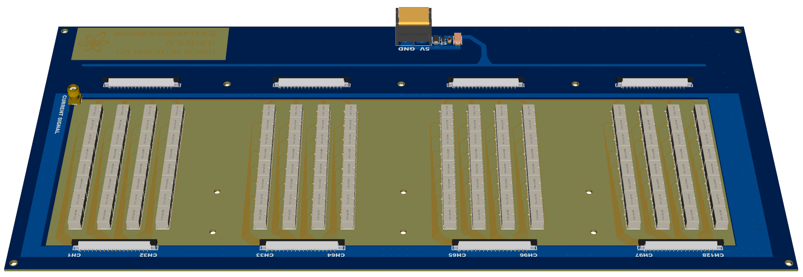
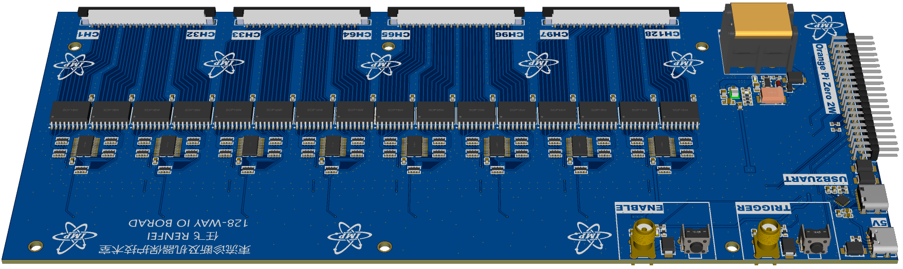

# 128-way-relay-current-routing-electronics (for slow extraction testing)

## 3d model

  
 click me to show 3d model images

  ### relay board
  

  ### controller board
  

## usage
- mounting all boards on to 1U case using M3 bolts
- connect raspberry pi zero to controller board via 40-pin cable
- solder USB type-A socket to 2.54mm header cable to pi zero
- insert TF card with EPICS SOFTIOC inside to pi zero
- mount usb to 1U case (rear)
- connect all 36-pin FPC cables
- connect ENABLE/TRIGGER/INPUT coax cable to 1U case (front)
- mount AC/DC module (220V to 5V) to 1U case (bottom)
- connect 5V/GND cable to both controller & relay boards
- connect a USB-to-ETHERNET module to USB type-A socket
- connect ETHERNET cable
- power up